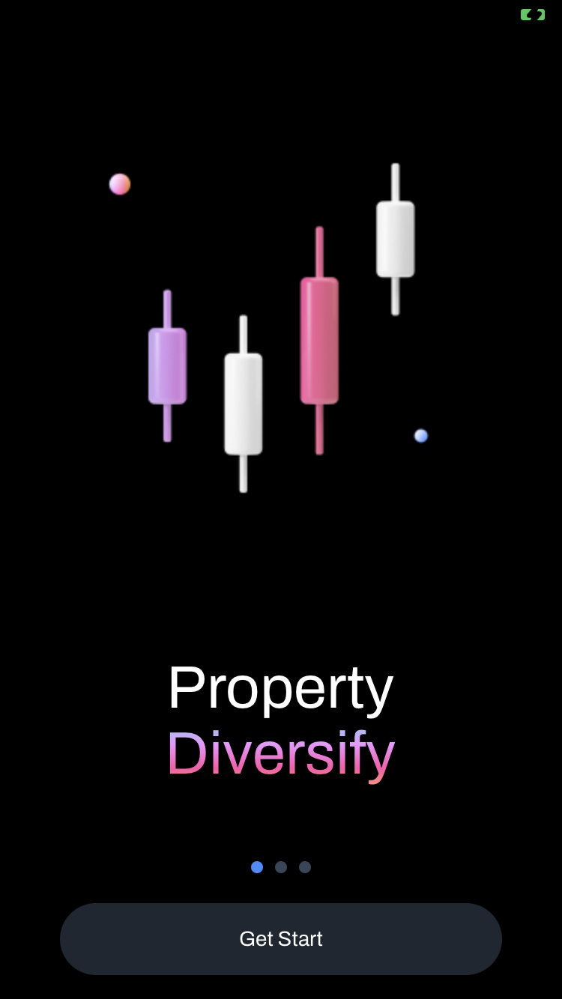
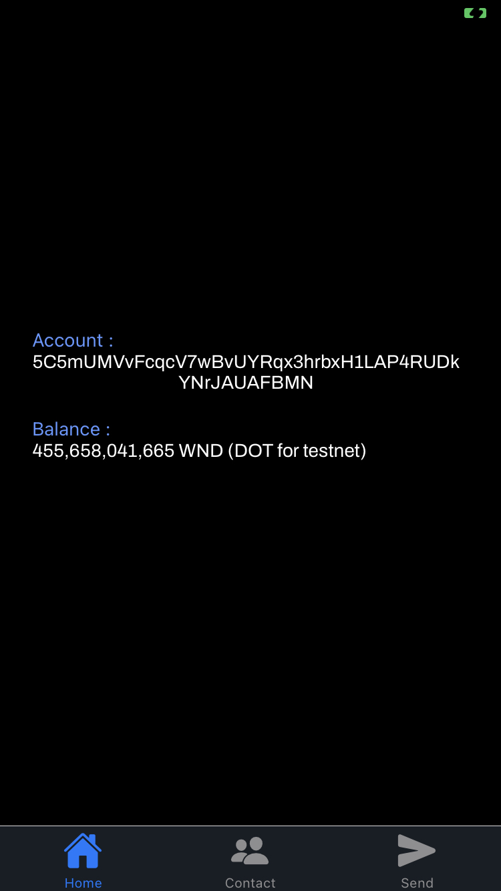

# Test assignment #2

The goal was to create a simple cryptocurrency wallet application working with polkadot tesnet.

## Implementation

There were some technical implementations.
I'd like to talk about the whys.

### Expo

I've used [Expo](https://expo.dev/) to speed up mobile development as I'm new to it (as recommended by [React Native documentation](https://reactnative.dev/docs/environment-setup)).

### Node backend as a Polkadot proxy

React Native doesn't seem to support Polkadot{.js} dependencies.

I've spent quite some time on it and after [trying this approach from one of Polkadot's core team](https://github.com/jacogr/pjs-rn-rncli/blob/master/metro.config.js) and other solutions, I had to think of an another way.

Which leads us to using a [backend](https://github.com/lakchote/node_polkadot) to query Polkadot nodes.

### Ngrok

In order for React native to query the API on localhost we need to use Ngrok.

Please follow [here](https://ngrok.com/docs/getting-started#step-2-install-the-ngrok-agent) for instructions related to your platform if you don't have ngrok already.

### React Native for Web

I've used [MaskedView](https://docs.expo.dev/versions/latest/sdk/masked-view/) in order to have a design as close as possible for the text gradient of the Figma design at the intro screen.

Unfortunately, it isn't supported right now on React Native Web, that's why you need to use mobile devices (simulated or real ones) when you run it.

## How to run

1. Launch ngrok with your [node backend](https://github.com/lakchote/node_polkadot) already listening on port

`ngrok 1337`

2. Create and fill an `.env` file using `.env.example` as a template

3. Install dependencides

`yarn install`

4. Launch Expo

`yarn expo start`

[Run on physical device](https://docs.expo.dev/workflow/run-on-device/#running-a-project-in-expo-go)

[Run on iOS simulation](https://docs.expo.dev/workflow/ios-simulator/)

[Run on Android simulation](https://docs.expo.dev/workflow/ios-simulator/)
